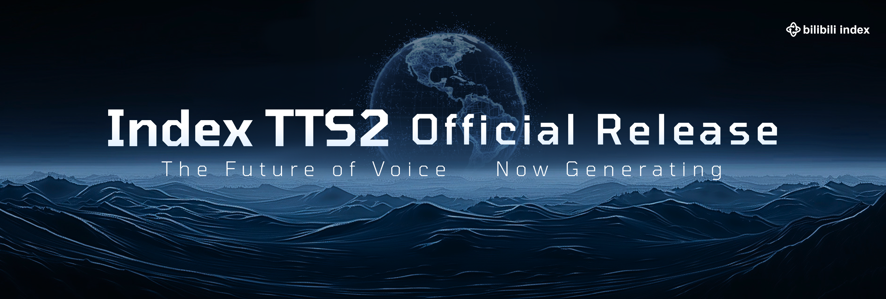
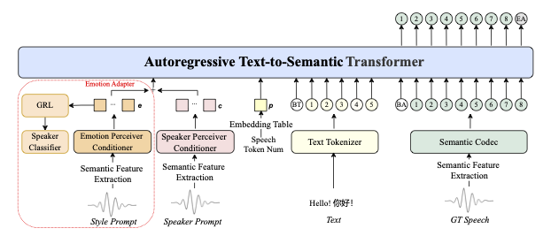

<div align="center">

</div>


## 👉🏻 IndexTTS2 👈🏻

<center><h3>IndexTTS2: A Breakthrough in Emotionally Expressive and Duration-Controlled Auto-Regressive Zero-Shot Text-to-Speech</h3></center>

[](assets/IndexTTS2_banner.png)

<div align="center">
  <a href='https://arxiv.org/abs/2506.21619'>
    
  </a>
  <br/>
  <a href='https://github.com/index-tts/index-tts'>
    
  </a>
  <a href='https://index-tts.github.io/index-tts2.github.io/'>
    
  </a>
  <br/>
  <!--a href='https://huggingface.co/spaces/IndexTeam/IndexTTS'>
    
  </a-->
  <a href='https://huggingface.co/IndexTeam/IndexTTS-2'>
    
  </a>
  <br/>
  <!--a href='https://modelscope.cn/studios/IndexTeam/IndexTTS-Demo'>
    
  </a-->
  <a href='https://modelscope.cn/models/IndexTeam/IndexTTS-2'>
    
  </a>
</div>

### Abstract

Existing autoregressive large-scale text-to-speech (TTS) models have advantages in speech naturalness, but their token-by-token generation mechanism makes it difficult to precisely control the duration of synthesized speech. This becomes a significant limitation in applications requiring strict audio-visual synchronization, such as video dubbing. This paper introduces IndexTTS2, which proposes a novel, general, and autoregressive model-friendly method for speech duration control. The method supports two generation modes: one explicitly specifies the number of generated tokens to precisely control speech duration; the other freely generates speech in an autoregressive manner without specifying the number of tokens, while faithfully reproducing the prosodic features of the input prompt. Furthermore, IndexTTS2 achieves disentanglement between emotional expression and speaker identity, enabling independent control over timbre and emotion. In the zero-shot setting, the model can accurately reconstruct the target timbre (from the timbre prompt) while perfectly reproducing the specified emotional tone (from the style prompt). To enhance speech clarity in highly emotional expressions, we incorporate GPT latent representations and design a novel three-stage training paradigm to improve the stability of the generated speech. Additionally, to lower the barrier for emotional control, we designed a soft instruction mechanism based on text descriptions by fine-tuning Qwen3, effectively guiding the generation of speech with the desired emotional orientation. Finally, experimental results on multiple datasets show that IndexTTS2 outperforms state-of-the-art zero-shot TTS models in terms of word error rate, speaker similarity, and emotional fidelity. Audio samples are available at: <a href="https://index-tts.github.io/index-tts2.github.io/">IndexTTS2 demo page</a>

**Tips:** Please contact authors for more detailed information. For commercial cooperation, please contact <u>indexspeech@bilibili.com</u>

### Feel IndexTTS2
<div align="center">

**IndexTTS2: The Future of Voice, Now Generating**

[](https://www.bilibili.com/video/BV136a9zqEk5)

*Click the image to watch IndexTTS2 video*

</div>

### Contact
QQ Group：553460296(No.1) 663272642(No.4)\
Discord：https://discord.gg/uT32E7KDmy  \
Emal：indexspeech@bilibili.com  \
欢迎大家来交流讨论！
## 📣 Updates

- `2025/09/08` 🔥🔥🔥  We release the **IndexTTS-2**
    - The first autoregressive TTS model with precise synthesis duration control, supporting both controllable and uncontrollable modes. <i>This functionality is not yet enabled in this release.</i>
    - The model achieves highly expressive emotional speech synthesis, with emotion-controllable capabilities enabled through multiple input modalities.
- `2025/05/14` 🔥🔥 We release the **IndexTTS-1.5**, Significantly improve the model's stability and its performance in the English language.
- `2025/03/25` 🔥 We release **IndexTTS-1.0** model parameters and inference code.
- `2025/02/12` 🔥 We submitted our paper on arXiv, and released our demos and test sets.

## 🖥️ Method

The overview of IndexTTS2 is shown as follows.

<picture>
  
</picture>


The key contributions of **indextts2** are summarized as follows:
 - We propose a duration adaptation scheme for autoregressive TTS models. IndexTTS2 is the first autoregressive zero-shot TTS model to combine precise duration control with natural duration generation, and the method is scalable for any autoregressive large-scale TTS model.  
 - The emotional and speaker-related features are decoupled from the prompts, and a feature fusion strategy is designed to maintain semantic fluency and pronunciation clarity during emotionally rich expressions. Furthermore, a tool was developed for emotion control, utilising natural language descriptions for the benefit of users.  
 - To address the lack of highly expressive speech data, we propose an effective training strategy, significantly enhancing the emotional expressiveness of zeroshot TTS to State-of-the-Art (SOTA) level.  
 - We will publicly release the code and pre-trained weights to facilitate future research and practical applications.  


## Model Download
| **HuggingFace**                                          | **ModelScope** |
|----------------------------------------------------------|----------------------------------------------------------|
| [😁 IndexTTS-2](https://huggingface.co/IndexTeam/IndexTTS-2) | [IndexTTS-2](https://modelscope.cn/models/IndexTeam/IndexTTS-2) |
| [IndexTTS-1.5](https://huggingface.co/IndexTeam/IndexTTS-1.5) | [IndexTTS-1.5](https://modelscope.cn/models/IndexTeam/IndexTTS-1.5) |
| [IndexTTS](https://huggingface.co/IndexTeam/Index-TTS) | [IndexTTS](https://modelscope.cn/models/IndexTeam/Index-TTS) |


## Usage Instructions
### Environment Setup

1. Download this repository:
```bash
git clone https://github.com/index-tts/index-tts.git && cd index-tts
git lfs pull # fetch example files
```

2. Install the [uv](https://docs.astral.sh/uv/getting-started/installation/) package
   manager. It is *required* for a reliable, modern installation environment.

3. Install dependencies:

We use `uv` to manage the project's dependency environment.
```bash
uv sync
```

4. Download models:

Download via `huggingface-cli`:
```bash
hf download IndexTeam/IndexTTS-2 --local-dir=checkpoints
```

Or download via `modelscope`
```bash
modelscope download --model IndexTeam/IndexTTS-2 --local_dir checkpoints
```

>In addition to the above models, some small models will also be automatically downloaded when the project is run for the first time. If your network environment has slow access to HuggingFace, it is recommended to execute command below. <br>
除了以上模型外，项目初次运行时还会自动下载一些小模型，如果您的网络环境访问HuggingFace的速度较慢，推荐执行：
>```bash
>export HF_ENDPOINT="https://hf-mirror.com"
>```


### IndexTTS2 Quickstart

Examples of running scripts with `uv`.
```bash
PYTHONPATH=$PYTHONPATH:. uv run python indextts/infer_v2.py
```

1. Synthesize speech with a single reference audio only:
```python
from indextts.infer_v2 import IndexTTS2
tts = IndexTTS2(cfg_path="checkpoints/config.yaml", model_dir="checkpoints", is_fp16=False, use_cuda_kernel=False)
text = "Translate for me，what is a surprise!"
tts.infer(spk_audio_prompt='examples/voice_01.wav', text=text, output_path="gen.wav", verbose=True)
```

2. Use additional emotional reference audio to condition speech synthesis:
```python
from indextts.infer_v2 import IndexTTS2
tts = IndexTTS2(cfg_path="checkpoints/config.yaml", model_dir="checkpoints", is_fp16=False, use_cuda_kernel=False)
text = "酒楼丧尽天良，开始借机竞拍房间，哎，一群蠢货。"
tts.infer(spk_audio_prompt='examples/voice_07.wav', text=text, output_path="gen.wav", emo_audio_prompt="examples/emo_sad.wav", verbose=True)
```

3. When an emotional reference audio is specified, you can additionally set the `emo_alpha` parameter. Default value is `1.0`:
```python
from indextts.infer_v2 import IndexTTS2
tts = IndexTTS2(cfg_path="checkpoints/config.yaml", model_dir="checkpoints", is_fp16=False, use_cuda_kernel=False)
text = "酒楼丧尽天良，开始借机竞拍房间，哎，一群蠢货。"
tts.infer(spk_audio_prompt='examples/voice_07.wav', text=text, output_path="gen.wav", emo_audio_prompt="examples/emo_sad.wav", emo_alpha=0.9, verbose=True)
```


4. It's also possible to omit the emotional reference audio and instead provide an 8-float list specifying the intensity of each base emotion (Happy | Angery | Sad | Fear | Hate | Low | Surprise | Neutral). You can additionally control the `use_random` parameter to decide whether to introduce stochasticity during inference; the default is `False`, and setting it to `True` increases randomness:
```python
from indextts.infer_v2 import IndexTTS2
tts = IndexTTS2(cfg_path="checkpoints/config.yaml", model_dir="checkpoints", is_fp16=False, use_cuda_kernel=False)
text = "哇塞！这个爆率也太高了！欧皇附体了！"
tts.infer(spk_audio_prompt='examples/voice_10.wav', text=text, output_path="gen.wav", emo_vector=[0, 0, 0, 0, 0, 0, 0.45, 0], use_random=False, verbose=True)
```

5. Use a text emotion description via `use_emo_text` to guide synthesis. Control randomness with `use_random` (default: False; True adds randomness):
```python
from indextts.infer_v2 import IndexTTS2
tts = IndexTTS2(cfg_path="checkpoints/config.yaml", model_dir="checkpoints", is_fp16=False, use_cuda_kernel=False)
text = "快躲起来！是他要来了！他要来抓我们了！"
tts.infer(spk_audio_prompt='examples/voice_12.wav', text=text, output_path="gen.wav", use_emo_text=True, use_random=False, verbose=True)
```

6. Without `emo_text`, infer emotion from the synthesis script; with `emo_text`, infer from the provided text.
```python
from indextts.infer_v2 import IndexTTS2
tts = IndexTTS2(cfg_path="checkpoints/config.yaml", model_dir="checkpoints", is_fp16=False, use_cuda_kernel=False)
text = "快躲起来！是他要来了！他要来抓我们了！"
emo_text = "你吓死我了！你是鬼吗？"
tts.infer(spk_audio_prompt='examples/voice_12.wav', text=text, output_path="gen.wav", use_emo_text=True, emo_text=emo_text, use_random=False, verbose=True)
```

### IndexTTS1 User Guide
```python
from indextts.infer import IndexTTS
tts = IndexTTS(model_dir="checkpoints",cfg_path="checkpoints/config.yaml")
voice = "examples/voice_07.wav"
text = "大家好，我现在正在bilibili 体验 ai 科技，说实话，来之前我绝对想不到！AI技术已经发展到这样匪夷所思的地步了！比如说，现在正在说话的其实是B站为我现场复刻的数字分身，简直就是平行宇宙的另一个我了。如果大家也想体验更多深入的AIGC功能，可以访问 bilibili studio，相信我，你们也会吃惊的。"
tts.infer(voice, text, 'gen.wav')
```
For more information, see [README_INDEXTTS_1_5](archive/README_INDEXTTS_1_5.md), or visit the specific version at <a href="https://github.com/index-tts/index-tts/tree/v1.5.0">index-tts:v1.5.0</a>

### Web Demo
```bash
PYTHONPATH=$PYTHONPATH:. uv run webui.py
```
Open your browser and visit `http://127.0.0.1:7860` to see the demo.

### Note for Windows Users

On Windows, you may encounter [an error](https://github.com/index-tts/index-tts/issues/61) when installing `pynini`:
`ERROR: Failed building wheel for pynini`

In this case, please install `pynini` via `conda`:

```bash
# after conda activate index-tts
conda install -c conda-forge pynini==2.1.5
pip install WeTextProcessing==1.0.3
pip install -e ".[webui]"
```


## 👉🏻 IndexTTS 👈🏻
### IndexTTS2: [[Paper]](https://arxiv.org/abs/2506.21619); [[Demo]](https://index-tts.github.io/index-tts2.github.io/)

### IndexTTS1: [[Paper]](https://arxiv.org/abs/2502.05512); [[Demo]](https://index-tts.github.io/); [[ModelScope]](https://modelscope.cn/studios/IndexTeam/IndexTTS-Demo); [[HuggingFace]](https://huggingface.co/spaces/IndexTeam/IndexTTS)


## Acknowledge
1. [tortoise-tts](https://github.com/neonbjb/tortoise-tts)
2. [XTTSv2](https://github.com/coqui-ai/TTS)
3. [BigVGAN](https://github.com/NVIDIA/BigVGAN)
4. [wenet](https://github.com/wenet-e2e/wenet/tree/main)
5. [icefall](https://github.com/k2-fsa/icefall)
6. [maskgct](https://github.com/open-mmlab/Amphion/tree/main/models/tts/maskgct)
7. [seed-vc](https://github.com/Plachtaa/seed-vc)


## 📚 Citation

🌟 If you find our work helpful, please leave us a star and cite our paper.


IndexTTS2
```
@article{zhou2025indextts2,
  title={IndexTTS2: A Breakthrough in Emotionally Expressive and Duration-Controlled Auto-Regressive Zero-Shot Text-to-Speech},
  author={Siyi Zhou, Yiquan Zhou, Yi He, Xun Zhou, Jinchao Wang, Wei Deng, Jingchen Shu},
  journal={arXiv preprint arXiv:2506.21619},
  year={2025}
}
```

IndexTTS
```
@article{deng2025indextts,
  title={IndexTTS: An Industrial-Level Controllable and Efficient Zero-Shot Text-To-Speech System},
  author={Wei Deng, Siyi Zhou, Jingchen Shu, Jinchao Wang, Lu Wang},
  journal={arXiv preprint arXiv:2502.05512},
  year={2025},
  doi={10.48550/arXiv.2502.05512},
  url={https://arxiv.org/abs/2502.05512}
}
```
